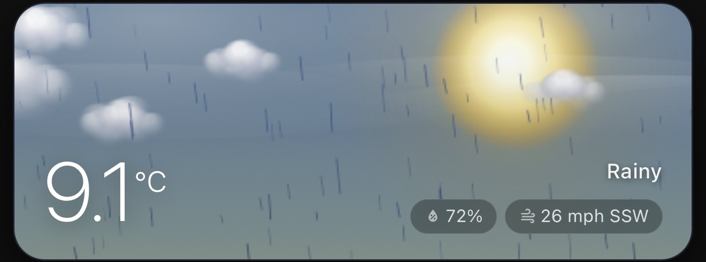
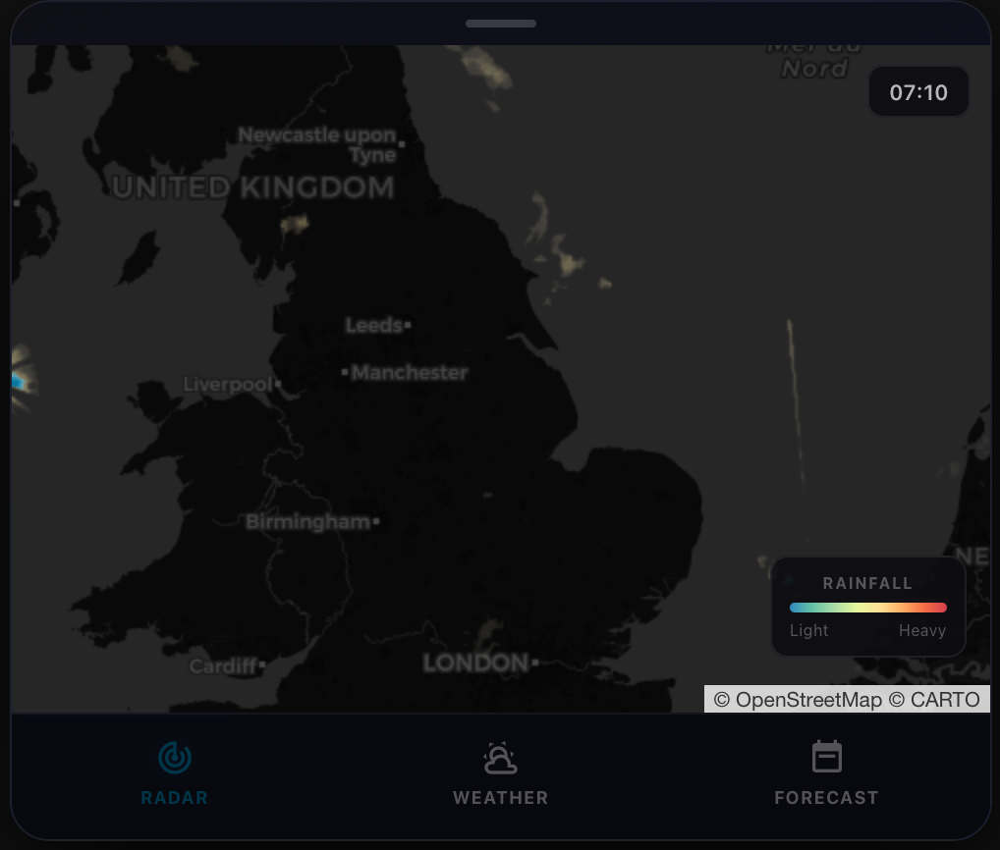
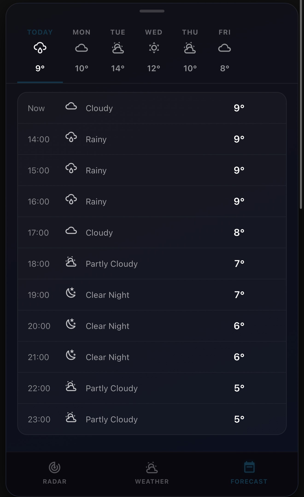
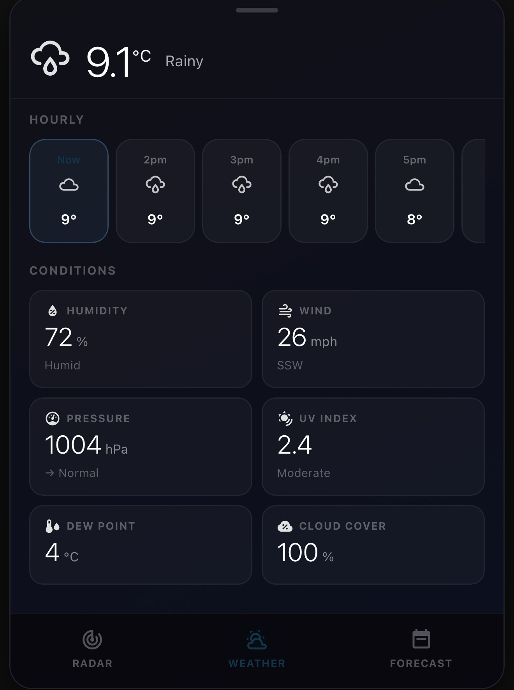
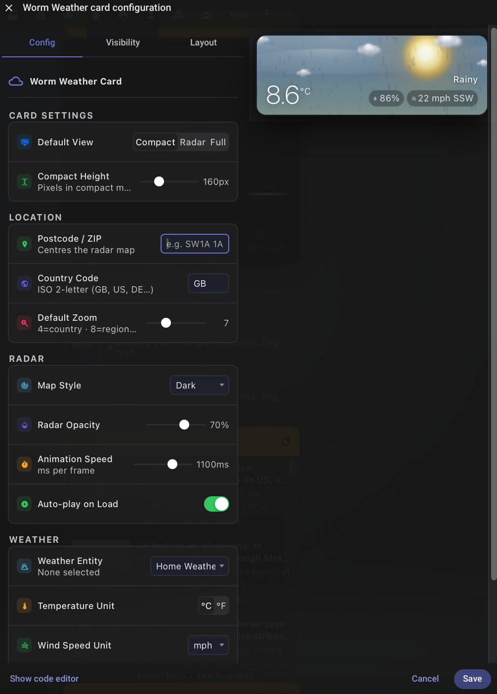

# 🌤️ Worm Weather Card

[](https://github.com/jamesmcginnis/worm-weather-card)

[](https://my.home-assistant.io/redirect/hacs_repository/?owner=jamesmcginnis&repository=worm-weather-card&category=plugin)

A custom Home Assistant Lovelace card combining a beautiful atmospheric weather animation with a live radar map and detailed forecast views.







---

## 🙏 Attribution

The atmospheric animation engine at the heart of this card — including the sky gradients, organic cloud system, stars, moon, sun, rain, snow, lightning, fog, birds, wind vapor, aurora, shooting stars, comets, planes with contrails, dust motes, and heat shimmer — is based almost entirely on the outstanding work of **[shpongledsummer](https://github.com/shpongledsummer)** and their [Atmospheric Weather Card](https://github.com/shpongledsummer/atmospheric-weather-card).

Without that project, this card would not exist in anything close to its current form. Please go and star their repository.

---

## ✨ Features

- **Animated atmospheric canvas** — condition-accurate sky with birds, aurora, shooting stars, comets, planes with contrails, dust motes, heat shimmer, rain, snow, lightning and more
- **Depth-layered volumetric clouds** — multi-puff organic clouds with rim highlights, parallax movement, and lightning flash response
- **Sci-Fi Effects** — individually toggleable surprise visitors:
  - 🛸 **UFO** — alien saucer glides in, hovers with a tractor beam, and a tiny alien waves from the dome before it zooms away
  - 🚀 **USS Enterprise** — NCC-1701 cruises across the full screen at a shallow angle, then engages warp and climbs out of frame with glowing nacelle trails
  - 🟩 **Borg Cube** — flies in, locks a cone-shaped green tractor beam onto the Sun or Moon, causing it to turn red and wobble, then disengages and departs. *Resistance is futile.*
  - ⭕ **Stargate** — a Stargate SG-1 style kawoosh erupts, the gate holds open with a rippling blue liquid surface and rotating chevron symbols, then closes
- **Angry Birds** — Red, Yellow, Chuck, Blue and Bomb birds launch one at a time from a bottom corner, arc across the full card, and occasionally explode mid-flight with a feather burst and a card shake
- **Live radar map** — powered by [RainViewer](https://www.rainviewer.com/), continuously animating the past ~2 hours of precipitation with smooth crossfade between frames and a vivid TITAN colour scheme. Pinch and scroll to zoom, drag to pan
- **Forecast tab** — scrollable day tabs with hourly breakdown; tap any day to see that day's hourly forecast
- **Weather tab** — compact current conditions with hourly strip and condition tiles (humidity, wind, pressure, UV, visibility, dew point, cloud cover, precipitation)
- **Clean visual editor** — configure everything without touching YAML

---

## 📦 Installation

### HACS (recommended)

1. Click the blue **Open in HACS** button above
2. Click **Download**
3. Reload your browser

### Manual

1. Copy `worm-weather-card.js` to `/config/www/`
2. In Home Assistant go to **Settings → Dashboards → Resources** and add:
   ```
   /local/worm-weather-card.js
   ```
   as a **JavaScript Module**
3. Reload your browser

---

## 🔧 Configuration

Add the card via the visual editor, or paste YAML directly:

```yaml
type: custom:worm-weather-card
weather_entity: weather.home
postcode: HU1 1AB          # optional — centres the radar map
country_code: GB            # optional — improves postcode geocoding
temp_unit: "°C"             # °C or °F
wind_unit: km/h             # km/h, mph or m/s
compact_height: 160         # height of the mini card in pixels
zoom_level: 7               # radar map default zoom (4–14)
radar_opacity: 0.7          # 0.0–1.0
animation_speed: 600        # milliseconds per radar frame
auto_animate: true          # start radar animation automatically
show_details: true          # condition tiles on Weather tab
show_wind_on_compact: false # wind speed on mini card
scifiUFO: true              # alien UFO animation
scifiEnterprise: true       # USS Enterprise animation
scifiBorg: true             # Borg Cube tractor beam animation
scifiWormhole: true         # Stargate wormhole animation
angryBirds: true            # Angry Birds flying across the card
```

---

## 🌦️ Animations

The card reads your weather entity condition and `sun.sun` to determine day or night, then renders the appropriate scene.

| Condition | What you see |
|---|---|
| Sunny / Exceptional | Blue sky, pulsing sun with corona, dust motes, heat shimmer |
| Partly Cloudy | Sky, sun, depth-layered volumetric clouds |
| Cloudy | Overcast clouds in multiple depth layers |
| Rainy / Pouring | Dark clouds, visible rain streaks |
| Snowy | Snow particles in three size tiers with wobble drift |
| Thunderstorm | Storm clouds, lightning bolts with branches, sky flash |
| Fog | Undulating fog banks |
| Windy | Wind vapor streaks, stronger cloud movement |
| Clear Night | Stars (240 twinkling), moon with craters, shooting stars, comets |
| Any night | Moon, stars appropriate to cloud cover |
| Any (rare) | Birds in V-formation, planes with contrails |
| Aurora | 4% chance on clear/partly-cloudy dark nights |
| Sci-Fi (optional) | UFO, USS Enterprise, Borg Cube, Stargate — each individually toggleable |
| Angry Birds (optional) | Red, Yellow, Blue, Black and Bomb birds launched one at a time |

---

## 🐦 Angry Birds

Flocks of 1–4 Angry Birds appear at random intervals. Each bird launches from a bottom corner of the card with realistic projectile physics — rising steeply, peaking near the top of the card, then curving down toward the opposite side. Birds are launched one at a time with a random gap between each, mimicking the slingshot reload in the game.

About 45% of birds explode mid-flight with a coloured feather burst and a brief card shake. All five classic birds are included: Red, Chuck (Yellow), Jay (Blue), Black, and Bomb.

---

## 🗺️ Radar

The radar layer is provided by [RainViewer](https://www.rainviewer.com/) and is free for personal use. The TITAN 2020 colour scheme is used for maximum contrast — light green for drizzle through to deep red for heavy rain. The animation loops through approximately 12 frames covering the past two hours, plus a short nowcast.

Postcode / ZIP geocoding is provided by the [Nominatim](https://nominatim.org/) service (OpenStreetMap). Without a postcode the map defaults to London.

---

## 📡 Forecast

This card uses the `weather.get_forecasts` WebSocket service introduced in Home Assistant 2023.9. Both hourly and daily forecasts are fetched simultaneously. If your integration only provides daily forecasts, each day tab will show a single summary row.

---

## 🤝 Credits

| | |
|---|---|
| **Atmospheric animations** | [shpongledsummer](https://github.com/shpongledsummer) — [atmospheric-weather-card](https://github.com/shpongledsummer/atmospheric-weather-card) |
| **Radar tiles** | [RainViewer](https://www.rainviewer.com/) |
| **Map tiles** | [OpenStreetMap](https://www.openstreetmap.org/) / [CartoCDN](https://carto.com/) |
| **Geocoding** | [Nominatim / OSM](https://nominatim.org/) |
| **Map library** | [Leaflet.js](https://leafletjs.com/) |

---

## 📄 License

MIT — see [LICENSE](LICENSE) for details.

The atmospheric animation code is derived from [atmospheric-weather-card](https://github.com/shpongledsummer/atmospheric-weather-card) by shpongledsummer, used with gratitude.